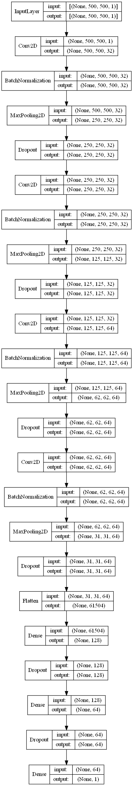

# CNN Model on Chest X-ray Dataset
Building a CNN model on chest x-ray dataset. We use a smaller sample of the dataset

Add more data to get a better result

[Dataset on kaggle](https://www.kaggle.com/datasets/paultimothymooney/chest-xray-pneumonia)

## Contents
### Data Augmentation
The data is huge, so we don't load the data directly

There are two classes and the data is imbalanced
### Imbalanced Data Handling
* Class weights

### Modeling
We use the following architecture for our model

### Model Improving
* Early stopping
* ReduceLROnPlateau

### Evaluation
* Accuracy and loss plotting